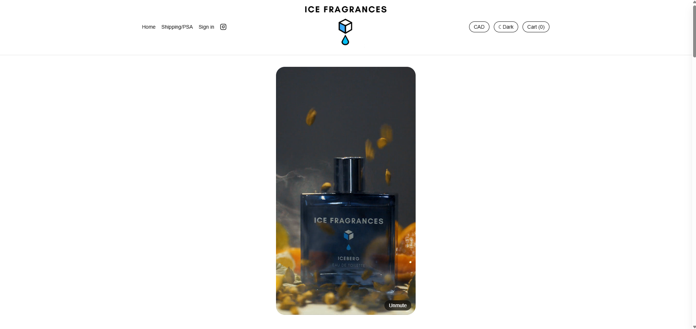

# Ice Fragrances

**A production e-commerce storefront for a premium cologne brand — video-forward,
Stripe-powered, and built for real online selling.** Browse fragrances, apparel, and
home scents; add to cart; and check out with real card payments, shipping, and tax.

🛒 **Live store:** **[icefragrances.com](https://icefragrances.com/)**



---

## Why this project

I built and shipped Ice Fragrances as a **real online store**, not a mockup — it takes
live payments through Stripe, fulfills orders via webhooks, sends confirmation emails,
and tracks conversions. It started as a one-page shop and grew into a full storefront
with accounts, reviews, and an admin panel. The interesting work was less "make it look
good" and more **handling money, trust, and edge cases correctly.**

## Features

- **Video-forward product cards** — each product has a looping, muted, lazy-loaded video
  (IntersectionObserver plays only what's on screen) that flips to a photo gallery.
- **Stripe Checkout** — server-built Checkout Sessions with **server-side price
  validation** (the API never trusts client-sent prices — anti-tamper by design),
  shipping-address collection, and tax.
- **Order fulfillment via Stripe webhooks** — a signed webhook records orders and
  triggers customer **confirmation emails** (with manual resend from the admin panel).
- **Verified-buyer reviews** — reviews are matched to real orders by email, so they work
  even for **guest checkouts**, with admin moderation + replies.
- **Multi-currency (USD / CAD)** with a flat import-tariff line on USD orders.
- **Admin panel** — moderate reviews, edit stock, resend order confirmations.
- **Light / dark mode** with brand-correct logos and OS-preference detection.
- **Conversion tracking** — Meta Pixel + server-side Conversions API.

## Tech stack

| Layer | Tech |
|---|---|
| Framework | Next.js (App Router) · React · TypeScript |
| Styling | Tailwind CSS (CSS-variable theming, light/dark) |
| Payments | Stripe Checkout + signed webhooks |
| Database | Postgres · Drizzle ORM |
| Auth | Clerk |
| Email | transactional order-confirmation emails |
| Analytics | Meta Pixel + Conversions API |
| Testing | Vitest |
| Hosting | Vercel (global CDN, self-hosted compressed video) |

## Engineering decisions I'm proud of

- **The server never trusts the client's prices.** `/api/checkout` re-derives every line
  item's amount from a server-side product config before creating the Stripe session, so
  a tampered cart can't change what you're charged.
- **Reviews tied to real purchases.** Matching reviews to orders by email (not just login)
  means guest buyers can still leave verified-buyer reviews — trust without forcing accounts.
- **Performance under heavy media.** Source videos were 600 MB+; they're compressed once
  with ffmpeg and lazy-played via IntersectionObserver so the page stays fast.
- **Single source of truth for the catalog** (`lib/products.ts`) drives both the grid and
  server-side price validation.

## Catalog

Four signature colognes (**$108**, 13–18% fragrance oil, free shipping) — Frost, Glacier,
Hailstone, Iceberg — plus limited-run apparel, a scented humidifier, and car fresheners.

## Testing

```bash
npm test          # 25 tests (cart store, checkout price validation, shipping, components)
npx tsc --noEmit  # strict typecheck, clean
```

## Running locally

```bash
git clone https://github.com/Chri2K02/ice-fragrances.git
cd ice-fragrances
npm install
cp .env.example .env.local   # add your Stripe test key + site URL
npm run dev                  # http://localhost:3000
```

See [`.env.example`](.env.example) for required environment variables. Stripe runs in test
mode locally — use a [test card](https://docs.stripe.com/testing) (e.g. `4242 4242 4242 4242`).

---

*Built by [Christian Kearns](https://github.com/Chri2K02).*
